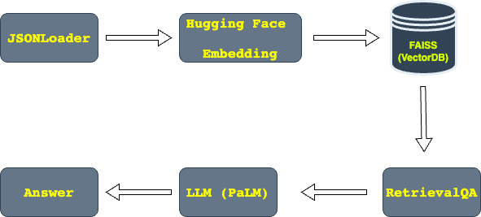
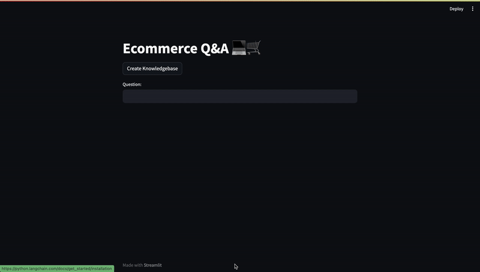

# Ecommerce Q&A platform with Google PaLM in LangChain

## Overview

This E-commerce Q&A platform is designed to intelligently answers user questions by analyzing previously asked questions from other users. This project leverages the capabilities of Language Model Models, with a specific focus on the `Google PaLM` model incorporated within LangChain. To enhance the data management aspect, is utilized `FASSI from META` as a vector database. The data source is Kaggle. You can find it by following this [link](https://www.kaggle.com/datasets/saadmakhdoom/ecommerce-faq-chatbot-dataset).
The end result is a user-friendly `Streamlit` application.

## Features

- Load json file to fetch the content using LangChain's JSONLoader.
- Construct embeddings vector using HuggingFaceInstructEmbeddings. 
- Leverage FAISS, a powerful similarity search library, to enable swift and effective retrieval of relevant information.
- Interact with the LLM (Google PaLM) by inputting queries and receiving answers.

## Project Flowchart



## Demo


## Environment Variables

To run this project, you will need to add `GOOGLE_API_KEY` environment variable to your .env file. To generate an API key, please go to the `MakerSuite` web page using the following [link](https://makersuite.google.com/).

## Run Locally

## Prerequisites

Before using this tool, make sure you have the following prerequisites installed:

- Python 3.11
- [Poetry](https://python-poetry.org/): You can install it following the [Poetry installation guide](https://python-poetry.org/docs/#installation).
- All dependencies can be installed using poetry. Simply run `poetry install` command.

Clone the project

```bash
  git https://github.com/armanbabayan/News-research-tool-with-LangChain.git
```

Go to the project directory

```bash
  cd Ecommerce-QA-Platform-with-Google-Palm-in-LangChain
```

Install dependencies

```bash
  poetry install
```

Start the server

```bash
 poetry run streamlit run  main.py
```


## Tech Stack
**Language:**  Python 3

**Library:** LangChain, Faiss, Streamlit

**Model:** Google PaLM

[](https://www.python.org/)  

<div style="flex: 50%; padding: 5px;">
    
    
    
  </div>


## Authors

- [@armanbabayan](https://github.com/armanbabayan)

